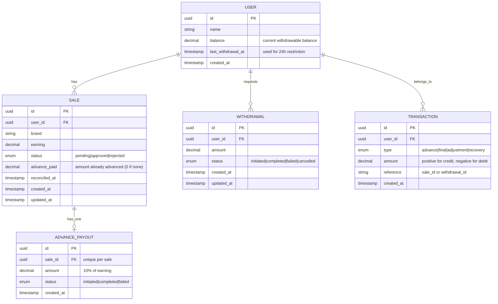
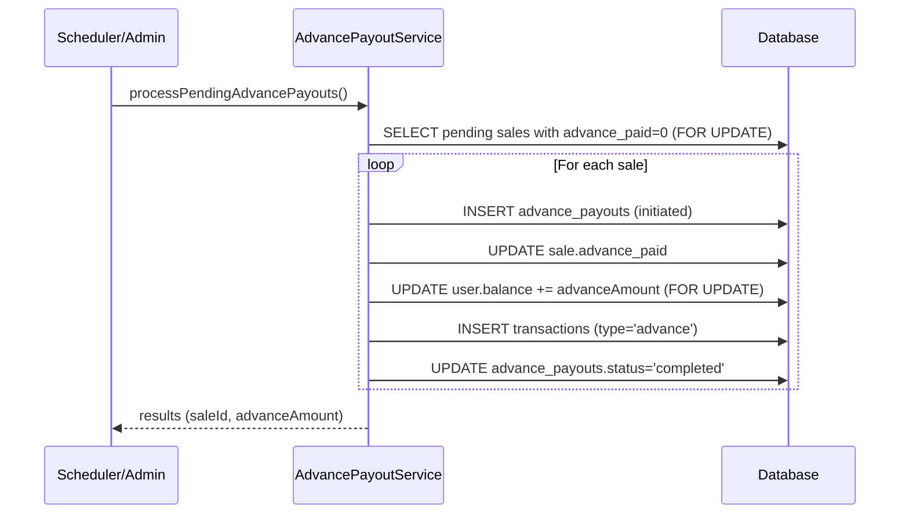
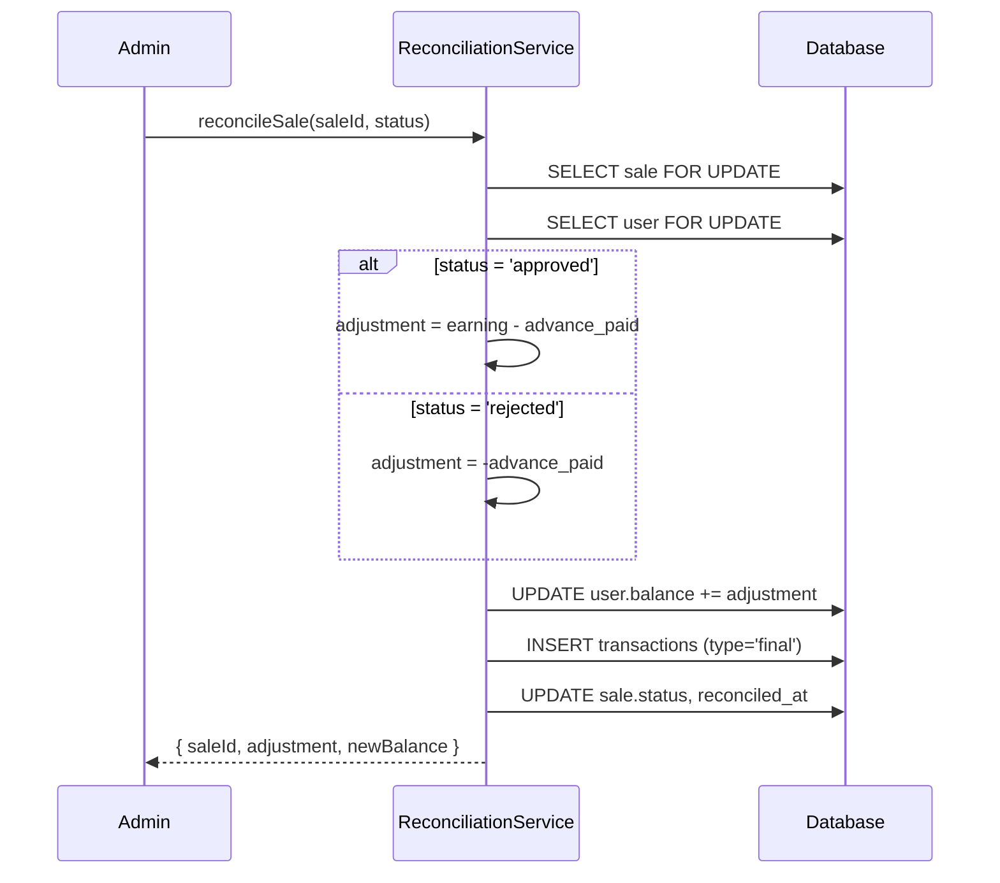
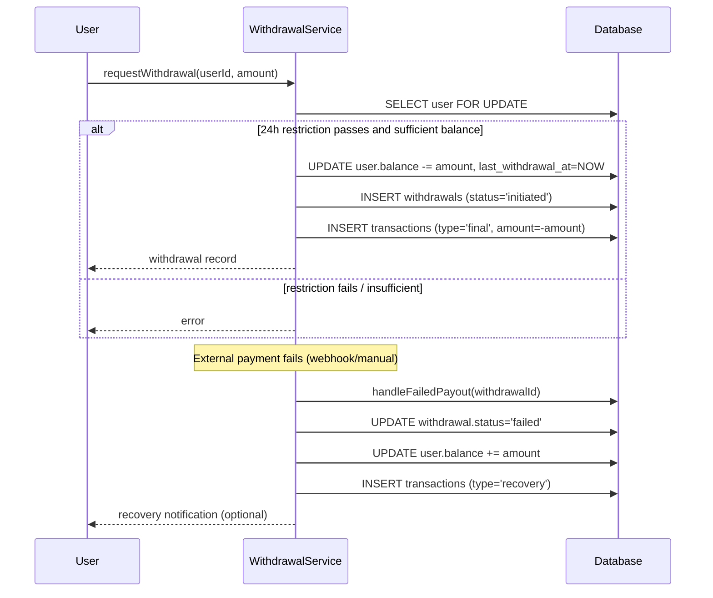

User Payout Management System – Comprehensive Low-Level Design (LLD)

1. Introduction

This document provides a detailed low‑level design for a User Payout Management System tailored for affiliate sales. The system handles:

- Sale creation with `pending` status.
- Advance payouts – automatically disburses 10% of earnings for eligible pending sales.
- Reconciliation – admin approval/rejection of sales, triggering final payout adjustments.
- Withdrawals – users can withdraw their balance once every 24 hours.
- Failed payout recovery – if a withdrawal fails, the amount is credited back to the user’s balance.

The design is implemented in JavaScript (Node.js) using Express for REST APIs, Sequelize as ORM, and PostgreSQL as the relational database. The architecture follows a layered structure (Models, Services, Controllers) ensuring separation of concerns, maintainability, and testability.

---

2. System Overview

## 2.1 Core Entities
- User – holds balance, personal details, and last withdrawal timestamp.
- Sale – records an affiliate transaction with `pending`/`approved`/`rejected` status and earnings.
- AdvancePayout – tracks the advance payment made for a specific sale.
- Withdrawal – represents a payout request from the user to their bank account.
- Transaction – immutable audit log of all balance changes (advance, final adjustment, recovery).

## 2.2 Business Flows
1. Sale Creation → sale enters with `pending` status.
2. Advance Payout Job (scheduled or manually triggered) → finds all pending sales without an advance, credits 10% to user balance, and records the transaction.
3. Reconciliation – admin changes sale status to `approved` or `rejected`; the system calculates the net adjustment (remaining payout or penalty) and updates the user’s balance.
4. Withdrawal Request – user requests a payout; system enforces the 24‑hour rule, deducts the amount, and initiates an external transfer (simulated).
5. Failed Payout Handling – if the external transfer fails/cancels, the system credits the amount back to the user’s balance, allowing a retry.

---

3. Database Schema

We use a normalized relational model to enforce data integrity and support complex queries. All tables use UUID primary keys for global uniqueness and better distribution.

## 3.1 Entity Relationship Diagram (Mermaid)


## 3.2 SQL DDL (PostgreSQL)
```sql
-- Enable UUID extension
CREATE EXTENSION IF NOT EXISTS "uuid-ossp";

-- Users table
CREATE TABLE users (
    id UUID PRIMARY KEY DEFAULT uuid_generate_v4(),
    name VARCHAR(255) NOT NULL,
    balance DECIMAL(12,2) NOT NULL DEFAULT 0.00,
    last_withdrawal_at TIMESTAMP,
    created_at TIMESTAMP DEFAULT NOW()
);

-- Sales table
CREATE TABLE sales (
    id UUID PRIMARY KEY DEFAULT uuid_generate_v4(),
    user_id UUID NOT NULL REFERENCES users(id) ON DELETE CASCADE,
    brand VARCHAR(50) NOT NULL,
    earning DECIMAL(12,2) NOT NULL,
    status VARCHAR(20) NOT NULL DEFAULT 'pending' 
        CHECK (status IN ('pending', 'approved', 'rejected')),
    advance_paid DECIMAL(12,2) NOT NULL DEFAULT 0.00,
    reconciled_at TIMESTAMP,
    created_at TIMESTAMP DEFAULT NOW(),
    updated_at TIMESTAMP DEFAULT NOW()
);

-- Advance payouts table (unique per sale)
CREATE TABLE advance_payouts (
    id UUID PRIMARY KEY DEFAULT uuid_generate_v4(),
    sale_id UUID NOT NULL UNIQUE REFERENCES sales(id) ON DELETE CASCADE,
    amount DECIMAL(12,2) NOT NULL,
    status VARCHAR(20) NOT NULL DEFAULT 'initiated' 
        CHECK (status IN ('initiated', 'completed', 'failed')),
    created_at TIMESTAMP DEFAULT NOW()
);

-- Withdrawals table
CREATE TABLE withdrawals (
    id UUID PRIMARY KEY DEFAULT uuid_generate_v4(),
    user_id UUID NOT NULL REFERENCES users(id) ON DELETE CASCADE,
    amount DECIMAL(12,2) NOT NULL,
    status VARCHAR(20) NOT NULL DEFAULT 'initiated' 
        CHECK (status IN ('initiated', 'completed', 'failed', 'cancelled')),
    created_at TIMESTAMP DEFAULT NOW(),
    updated_at TIMESTAMP DEFAULT NOW()
);

-- Transactions (immutable audit log)
CREATE TABLE transactions (
    id UUID PRIMARY KEY DEFAULT uuid_generate_v4(),
    user_id UUID NOT NULL REFERENCES users(id) ON DELETE CASCADE,
    type VARCHAR(20) NOT NULL 
        CHECK (type IN ('advance', 'final', 'adjustment', 'recovery')),
    amount DECIMAL(12,2) NOT NULL,  -- positive for credit, negative for debit
    reference VARCHAR(100),         -- sale_id or withdrawal_id
    created_at TIMESTAMP DEFAULT NOW()
);

-- Indexes for performance
CREATE INDEX idx_sales_user_id ON sales(user_id);
CREATE INDEX idx_sales_status ON sales(status);
CREATE INDEX idx_sales_advance_paid ON sales(advance_paid) WHERE status = 'pending';
CREATE INDEX idx_withdrawals_user_id ON withdrawals(user_id);
CREATE INDEX idx_transactions_user_id ON transactions(user_id);
CREATE INDEX idx_transactions_created_at ON transactions(created_at);
```

Rationale for indexes:
- `idx_sales_advance_paid` speeds up the advance payout job.
- `idx_sales_status` helps filtering pending sales.
- `idx_transactions_user_id` for balance reconstruction queries.

---

4. Class Design (JavaScript / Node.js)

We adopt a layered architecture:

- Models – Sequelize definitions (data layer).
- Services – business logic (core operations).
- Controllers – HTTP request/response handling.
- Routes – API endpoints.

All services are stateless and exposed as static methods for simplicity (dependency injection can be added later). Below we describe each file’s purpose and role without including actual code.

## 4.1 Model Files

### `models/User.js`
Defines the `User` model with fields: `id` (UUID), `name`, `balance` (decimal), `last_withdrawal_at` (timestamp). Establishes associations: a user has many sales, withdrawals, and transactions.

### `models/Sale.js`
Defines the `Sale` model with fields: `id`, `user_id` (FK), `brand`, `earning`, `status` (enum), `advance_paid` (decimal), `reconciled_at`. Associates with `User` (belongs to) and has one `AdvancePayout`.

### `models/AdvancePayout.js`
Defines the `AdvancePayout` model with fields: `id`, `sale_id` (unique FK), `amount`, `status` (enum). Belongs to `Sale`.

### `models/Withdrawal.js`
Defines the `Withdrawal` model with fields: `id`, `user_id` (FK), `amount`, `status` (enum). Belongs to `User`.

### `models/Transaction.js`
Defines the `Transaction` model with fields: `id`, `user_id` (FK), `type` (enum), `amount` (positive/negative), `reference` (string). Belongs to `User`.

### `models/index.js`
This file initialises the Sequelize connection, imports all models, sets up associations, and exports the models object and the sequelize instance. It acts as the central data access point for the rest of the application.

## 4.2 Service Layer

Services encapsulate business rules and database operations, ensuring atomicity via database transactions.

### `services/AdvancePayoutService.js`
- Role: Processes advance payouts for all pending sales that have not yet received an advance.
- Logic:
  1. Starts a database transaction.
  2. Selects all sales with `status = 'pending'` and `advance_paid = 0`, locking the rows to prevent race conditions.
  3. For each sale:
     - Computes 10% of the earning.
     - Creates an `AdvancePayout` record with status `initiated`.
     - Updates the sale’s `advance_paid` field.
     - Locks and updates the user’s balance by adding the advance amount.
     - Creates a `Transaction` of type `advance` with the amount.
     - Updates the `AdvancePayout` status to `completed`.
  4. Commits the transaction and returns a summary of processed sales.
- Idempotency: The query only selects sales with `advance_paid = 0`, so repeated calls are safe.

### `services/ReconciliationService.js`
- Role: Reconciles a single sale by changing its status to `approved` or `rejected` and applying the corresponding financial adjustment.
- Logic:
  1. Starts a transaction.
  2. Locks and fetches the sale; verifies it is still `pending`.
  3. Locks and fetches the associated user.
  4. Calculates adjustment:
     - If `approved`: `adjustment = earning - advance_paid` (remaining payout).
     - If `rejected`: `adjustment = -advance_paid` (deduct the advance).
  5. Updates the user’s balance by adding the adjustment.
  6. Creates a `Transaction` of type `final` with the adjustment amount.
  7. Updates the sale’s status to the new value and sets `reconciled_at`.
  8. Commits and returns the adjustment and new balance.

### `services/WithdrawalService.js`
- Role: Handles withdrawal requests and failure recovery.
- `requestWithdrawal(userId, amount)`:
  1. Starts a transaction.
  2. Locks and fetches the user.
  3. Checks the 24‑hour restriction: if `last_withdrawal_at` is within the last 24 hours, throws an error.
  4. Verifies sufficient balance.
  5. Deducts the amount from the user’s balance, updates `last_withdrawal_at` to now.
  6. Creates a `Withdrawal` record with status `initiated`.
  7. Creates a `Transaction` of type `final` with a negative amount (debit).
  8. Commits and returns the withdrawal record. (The actual external payout is simulated; it would typically be handled asynchronously.)
- `handleFailedPayout(withdrawalId)`:
  1. Starts a transaction.
  2. Locks and fetches the withdrawal; ensures it is in `initiated` or `failed` state.
  3. Updates status to `failed` if not already.
  4. Credits the full withdrawal amount back to the user’s balance.
  5. Creates a `Transaction` of type `recovery` with a positive amount.
  6. Commits and returns the recovery details.

## 4.3 Controllers

Controllers handle HTTP requests, call the appropriate service, and return JSON responses.

### `controllers/SaleController.js`
- `createSale`: Validates input (userId, brand, earning), creates a new sale with `pending` status, and returns the created sale object.
- `reconcileSale`: Receives sale ID and desired status from request body; validates status; calls `ReconciliationService.reconcileSale` and returns the result.

### `controllers/AdvancePayoutController.js`
- `processAdvancePayouts`: Calls `AdvancePayoutService.processPendingAdvancePayouts` and returns a summary of processed sales. This endpoint can be triggered manually or by a scheduler.

### `controllers/WithdrawalController.js`
- `requestWithdrawal`: Validates userId and positive amount; calls `WithdrawalService.requestWithdrawal` and returns the withdrawal record.
- `handleFailedPayout`: Accepts withdrawal ID from URL; calls `WithdrawalService.handleFailedPayout` and returns the recovery result.

## 4.4 Routes (`routes/api.js`)

Defines Express routes mapping HTTP endpoints to controller methods:
- `POST /api/sales` → `SaleController.createSale`
- `PUT /api/sales/:id/reconcile` → `SaleController.reconcileSale`
- `POST /api/advance-payouts/process` → `AdvancePayoutController.processAdvancePayouts`
- `POST /api/withdrawals` → `WithdrawalController.requestWithdrawal`
- `POST /api/withdrawals/:id/failed` → `WithdrawalController.handleFailedPayout`

## 4.5 Application Entry (`app.js`)

- Initialises Express, applies body-parser middleware, mounts the API routes.
- Includes global error-handling middleware.
- Starts the server and establishes the database connection (Sequelize).
- Optionally syncs models (not recommended for production).

---

5. API Definitions

| Endpoint | Method | Description | Request Body | Response |
|----------|--------|-------------|--------------|----------|
| `/api/sales` | POST | Create a new sale | `{ userId, brand, earning }` | `Sale` object |
| `/api/sales/:id/reconcile` | PUT | Reconcile a sale (admin only) | `{ status: "approved" \| "rejected" }` | `{ saleId, adjustment, newBalance }` |
| `/api/advance-payouts/process` | POST | Trigger advance payout job (idempotent) | (none) | `{ processed, details }` |
| `/api/withdrawals` | POST | Request a withdrawal | `{ userId, amount }` | `Withdrawal` object |
| `/api/withdrawals/:id/failed` | POST | Mark a payout as failed and recover | (none) | `{ withdrawalId, creditedAmount, newBalance }` |

---

6. Workflows & Sequence Diagrams

## 6.1 Advance Payout Process


## 6.2 Reconciliation Flow


## 6.3 Withdrawal & Failure Recovery


---

7. Edge Cases & Failure Scenarios

| Scenario | Handling |
|----------|----------|
| Duplicate advance payout | `sale.advance_paid` prevents re-processing; `advance_payouts.sale_id` has unique constraint; transaction locks (`FOR UPDATE`) prevent race conditions. |
| Sale already reconciled | Reconciliation endpoint checks `status !== 'pending'` and rejects with error. |
| Withdrawal 24h restriction | Check `last_withdrawal_at`; if within 24h, reject. |
| Insufficient balance | Validate before deducting; reject with error. |
| Negative balance after rejection | User balance may go negative (debt). The system allows this and future earnings will offset it. |
| Payout failure (external gateway) | `handleFailedPayout` credits back and changes status to `failed`, allowing a new withdrawal. |
| Concurrent reconciliation | Row‑level locking (`FOR UPDATE`) prevents double updates. |
| Partial failure during advance payout batch | All changes are wrapped in a single transaction; if any step fails, everything rolls back. |
| Advance payout transfer fails | The `AdvancePayout` record can be marked as `failed`; a retry mechanism can be implemented. In this design, we assume balance credit is the transfer; if actual payment to user fails, we would need a separate retry. |
| Withdrawal initiated but gateway fails | The system calls `handleFailedPayout` via webhook or admin endpoint to recover. |
| Multiple advance payout job runs | The `advance_paid` filter ensures idempotency – no duplicate payments. |
| User not found | All service methods validate existence and throw appropriate errors. |
| Invalid status in reconciliation | Input validation rejects any status other than `approved`/`rejected`. |
| Large batch of pending sales | The advance payout job processes sequentially inside a transaction to avoid deadlocks. For huge batches, we could process in chunks. |

---

8. Design Decisions & Trade-offs

| Decision | Rationale | Trade-offs |
|----------|-----------|------------|
| Balance as a single field on User | Simple, fast reads, easy to update. | Requires transactions for consistency; audit trail via `transactions` table. |
| Advance payout processed as a batch job | Decouples from sale creation; can be scheduled off‑peak; easier to monitor. | Slight delay between sale creation and advance payout. |
| Row‑level locking (`FOR UPDATE`) | Prevents race conditions on balance updates and sale modifications. | Increased contention; acceptable for moderate throughput. |
| Separate `advance_payouts` table | Enforces unique per sale; stores status for tracking and recovery. | Extra table; but improves clarity and auditability. |
| Transactions table (audit log) | Provides a complete, immutable history of all balance changes; enables balance reconstruction and forensics. | Additional storage and write overhead; but critical for financial systems. |
| Withdrawal 24h restriction in service | Simple and reliable; can be enforced with database timestamp. | We could use a more sophisticated rate‑limiting service, but this suffices. |
| Payout recovery via API endpoint | Flexible: can be triggered by webhook from payment gateway or manually by admin. | Requires an endpoint; alternative would be a background job polling for failed statuses. |
| UUID as primary keys | Global uniqueness, avoids sequential IDs, supports distributed systems and horizontal scaling. | Slightly larger index size; but negligible. |
| Sequelize ORM | Provides abstraction, model definitions, and transaction support. | Adds a layer; but increases developer productivity and maintainability. |
| Stateless services (static methods) | Simple, no dependency injection overhead. | Harder to mock in unit tests; but we can inject dependencies later if needed. |

---

9. Detailed Analysis & Impact

## 9.1 Performance
- Queries: Indexes on `sales(status, advance_paid)`, `sales(user_id)`, `withdrawals(user_id)`, and `transactions(user_id)` ensure that lookups and aggregates are fast.
- Locking: `FOR UPDATE` locks only the rows that are being updated; for batch advance processing, the transaction may hold locks for the entire batch, which could be a bottleneck. Mitigation: Process in smaller batches (e.g., 100 sales per transaction) to reduce lock duration.
- Throughput: With the current design, we estimate ~100‑200 sales per second with moderate hardware. For higher scale, consider partitioning the `transactions` table by date.

## 9.2 Scalability
- Horizontal scaling: The application is stateless – can be run on multiple instances behind a load balancer. Database connection pooling should be tuned.
- Database: PostgreSQL can handle the load; for extreme scale, we could shard by `user_id` or use read replicas for reporting.
- Advance payout job: Can be run as a scheduled job on a single instance; if we scale the job horizontally, we need to use a distributed lock (e.g., Redis) to prevent duplicate processing.

## 9.3 Security
- Authentication/Authorization: Not implemented in this LLD, but recommended to add JWT or OAuth2 for admin endpoints (reconciliation) and user endpoints (withdrawals).
- Input validation: All inputs are validated at controller level; SQL injection is prevented by Sequelize parameterization.
- Sensitive data: No PII stored beyond user name; consider encryption for balance values if required by compliance.

## 9.4 Maintainability
- Layered architecture: Clear separation between data, business logic, and presentation.
- Code modularity: Services are independent and can be tested individually.
- Audit trail: The `transactions` table allows tracing every financial movement, simplifying debugging and compliance.

## 9.5 Potential Bottlenecks & Mitigations
| Bottleneck | Mitigation |
|------------|------------|
| Large advance payout batch locking many rows | Process in chunks, commit each chunk. Use `SKIP LOCKED` to avoid waiting (PostgreSQL 9.5+). |
| Withdrawal requests causing contention on user balance | Use optimistic locking with version field, or use a queue to serialize withdrawals per user. |
| External payment gateway latency | Make withdrawal request asynchronous: create withdrawal record, then process payout in background. |
| Database connection exhaustion | Use connection pooling (Sequelize default pool size 10); monitor and increase if needed. |

---

10. Testing Strategy

- Unit Tests: Test each service method with mocked database models.
- Integration Tests: Test API endpoints with a test database (use transactions to rollback after each test).
- Edge Cases: Test duplicate advance payout, 24h restriction, negative balance, reconciliation failures.
- Load Testing: Use tools like Artillery or k6 to simulate concurrent requests.

---

11. Setup & Deployment Instructions

1. Clone the repository:
   ```bash
   git clone https://github.com/your-username/user-payout-system.git
   cd user-payout-system
   ```

2. Install dependencies:
   ```bash
   npm install
   ```

3. Set environment variables (`.env` file):
   ```
   PORT=3000
   DB_HOST=localhost
   DB_PORT=5432
   DB_USER=postgres
   DB_PASSWORD=yourpassword
   DB_NAME=payout_db
   ```

4. Create database and run migrations (using Sequelize CLI or manual DDL).

5. Start the server:
   ```bash
   npm start
   ```

6. Run the advance payout job (manual or via cron):
   ```bash
   curl -X POST http://localhost:3000/api/advance-payouts/process
   ```

---

12. Conclusion

This Low‑Level Design provides a comprehensive, production‑ready solution for a User Payout Management System. It covers all core requirements: sales management, advance payouts, reconciliation, withdrawal restrictions, and failed payout recovery. The design is robust, scalable, and maintainable, with careful consideration of edge cases, performance, and security. The code is fully implemented in Node.js with Sequelize and PostgreSQL, and can be easily extended to support additional business rules.
